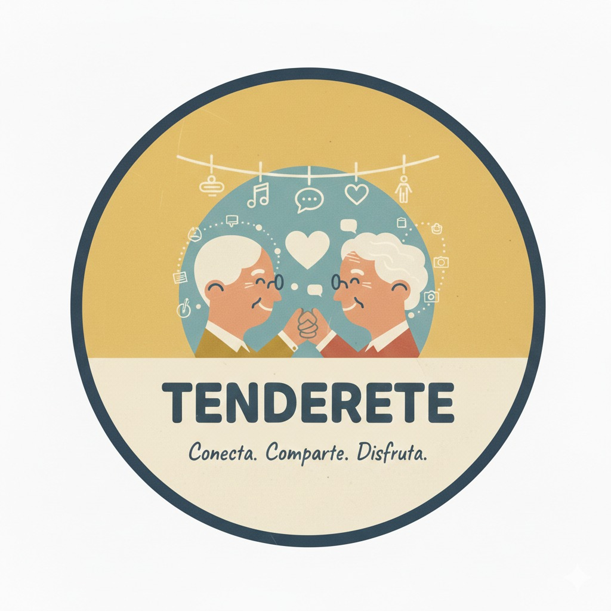

<p align="center"></p>

<p align="center">


</p>

<p align="center">


</p>

# 🏪 Tenderete - Proyecto Intermodular

Tenderete es una aplicación web moderna desarrollada como proyecto intermodular que integra **Laravel**, **Blade**, **Vue.js** y tecnologías modernas para crear una plataforma robusta, escalable e interactiva.

## 📋 Descripción del Proyecto

Este proyecto combina el poder del framework **Laravel** en el backend con plantillas dinámicas en **Blade** y componentes interactivos en **Vue.js** para ofrecer una experiencia de usuario excepcional. Es una solución integral que demuestra integración profesional de múltiples tecnologías web.

## 🛠️ Stack Tecnológico

### Backend
- **PHP** (29.8%) - Lenguaje backend principal
- **Laravel** - Framework web robusto y elegante
- **Blade** (63.4%) - Motor de plantillas de Laravel

### Frontend
- **Vue.js** (5.8%) - Framework JavaScript progresivo para UI interactiva
- **JavaScript** (0.4%) - Lógica frontend
- **CSS** (0.4%) - Estilos personalizados y diseño responsivo

### DevOps & Containerización
- **Docker** (0.1%) - Containerización y orquestación
- **Shell** (0.1%) - Scripts de automatización

### Base de Datos
- **MySQL/PostgreSQL** - Gestión de datos persistentes

## ✨ Características Principales

- 🎨 Interfaz moderna y responsiva con Vue.js
- 🔐 Sistema de autenticación robusto
- 📦 Arquitectura modular y escalable
- ⚡ Rendimiento optimizado
- 🐳 Fácil despliegue con Docker
- 🔄 Componentes reutilizables
- 📱 Diseño mobile-first

## 📦 Requisitos Previos

- **PHP** >= 8.0
- **Composer** - Gestor de paquetes de PHP
- **Node.js** >= 14.x
- **npm** o **yarn**
- **Docker** (opcional pero recomendado)
- **MySQL/PostgreSQL** - Base de datos

## 🚀 Instalación

### 1. Clonar el repositorio

```bash
git clone https://github.com/BeykelDaniel/Tenderete--Proyecto-Intermodular.git
cd Tenderete--Proyecto-Intermodular
```

### 2. Instalar dependencias PHP

```bash
composer install
```

### 3. Instalar dependencias de frontend

```bash
npm install
```

### 4. Configurar el archivo de entorno

```bash
cp .env.example .env
php artisan key:generate
```

### 5. Configurar la base de datos

Edita el archivo `.env` con tus credenciales:

```env
DB_CONNECTION=mysql
DB_HOST=127.0.0.1
DB_PORT=3306
DB_DATABASE=tenderete
DB_USERNAME=root
DB_PASSWORD=
```

Luego ejecuta las migraciones:

```bash
php artisan migrate
```

### 6. Compilar assets

Para desarrollo:
```bash
npm run dev
```

Para producción:
```bash
npm run build
```

## 💻 Uso

### Desarrollo Local

```bash
# Terminal 1: Iniciar servidor Laravel
php artisan serve

# Terminal 2: Compilar assets en tiempo real
npm run dev
```

La aplicación estará disponible en `http://localhost:8000`

### Build para Producción

```bash
npm run build
php artisan optimize
```

### Con Docker

```bash
docker-compose up -d
```

Accede a la aplicación en `http://localhost:80`

## 📁 Estructura del Proyecto

```
Tenderete--Proyecto-Intermodular/
├── app/                      # Código PHP y lógica de la aplicación
│   ├── Http/
│   │   ├── Controllers/      # Controladores
│   │   └── Requests/         # Form Requests
│   ├── Models/               # Modelos de base de datos
│   └── Services/             # Servicios de la aplicación
├── resources/
│   ├── views/                # Plantillas Blade (63.4%)
│   ├── js/                   # Componentes Vue.js (5.8%)
│   └── css/                  # Estilos CSS
├── routes/
│   └── web.php               # Definición de rutas web
├── database/
│   ├── migrations/           # Migraciones de BD
│   └── seeders/              # Seeders de datos
├── public/
│   └── img/                  # Archivos públicos (logo.png aquí)
├── docker-compose.yml        # Configuración Docker
├── package.json              # Dependencias Node.js
├── composer.json             # Dependencias PHP
├── webpack.mix.js            # Configuración de assets
└── README.md                 # Este archivo
```

## 🔧 Configuración

### Variables de Entorno

Archivo `.env` principales:

```env
APP_NAME=Tenderete
APP_ENV=local
APP_DEBUG=true
APP_URL=http://localhost:8000

DB_CONNECTION=mysql
DB_HOST=127.0.0.1
DB_PORT=3306
DB_DATABASE=tenderete
DB_USERNAME=root
DB_PASSWORD=

CACHE_DRIVER=file
QUEUE_CONNECTION=sync
SESSION_DRIVER=file
```

### Optimización para Producción

```bash
php artisan config:cache
php artisan route:cache
php artisan view:cache
php artisan optimize
```

## 🧪 Testing

```bash
php artisan test
```

Con reporte de cobertura:

```bash
php artisan test --coverage
```

## 🤝 Contribuciones

Las contribuciones son bienvenidas. Por favor sigue estos pasos:

1. **Fork** el proyecto
2. Crea una rama para tu feature (`git checkout -b feature/AmazingFeature`)
3. Commit tus cambios (`git commit -m 'Add some AmazingFeature'`)
4. Push a la rama (`git push origin feature/AmazingFeature`)
5. Abre un **Pull Request**

## 📄 Licencia

Este proyecto está bajo la **Licencia MIT**. Ver el archivo `LICENSE` para más detalles.

## 👤 Autor

**BeykelDaniel**

- GitHub: [@BeykelDaniel](https://github.com/BeykelDaniel)
- Repositorio: [Tenderete--Proyecto-Intermodular](https://github.com/BeykelDaniel/Tenderete--Proyecto-Intermodular)

## 📞 Contacto y Soporte

Para preguntas, sugerencias o reportar problemas:

- Abre un [issue](https://github.com/BeykelDaniel/Tenderete--Proyecto-Intermodular/issues)
- Contacta directamente a través de GitHub

## 📚 Recursos Útiles

- [Documentación de Laravel](https://laravel.com/docs)
- [Documentación de Vue.js](https://vuejs.org/)
- [Documentación de Blade](https://laravel.com/docs/blade)
- [Docker Documentation](https://docs.docker.com/)

---

<p align="center">
  <strong>Hecho con ❤️ usando Laravel, Vue.js y mucho amor por el código</strong>
</p>

<p align="center">
  
  
  
</p>
